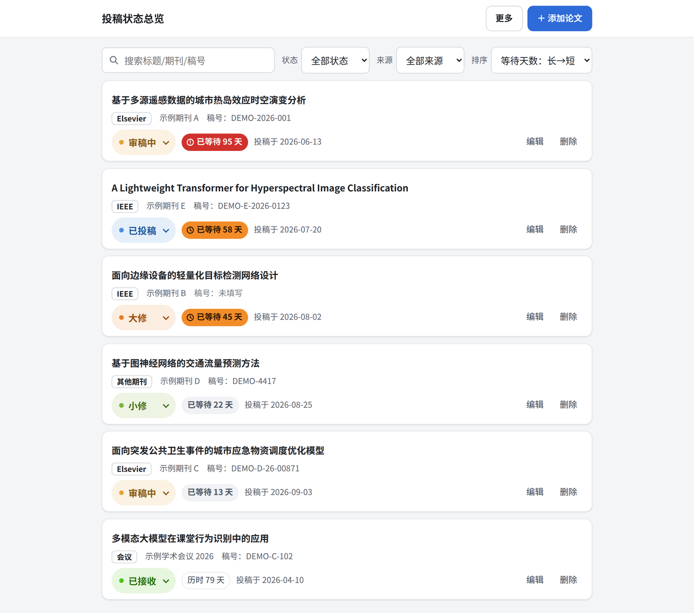
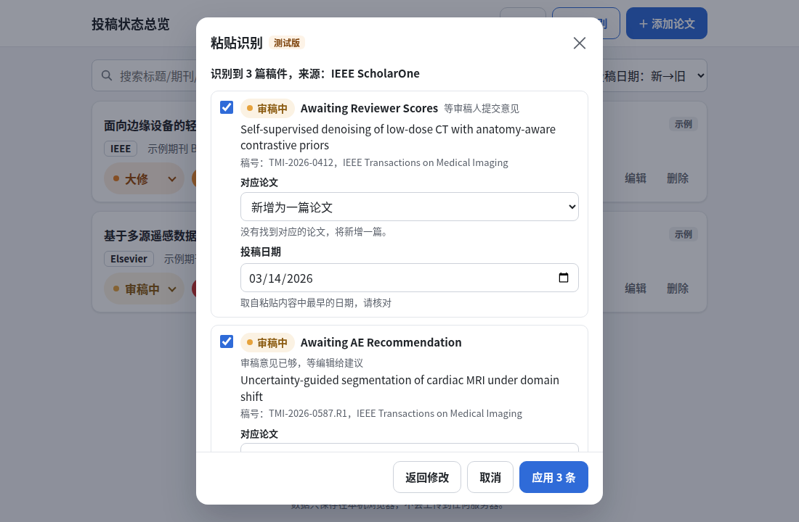
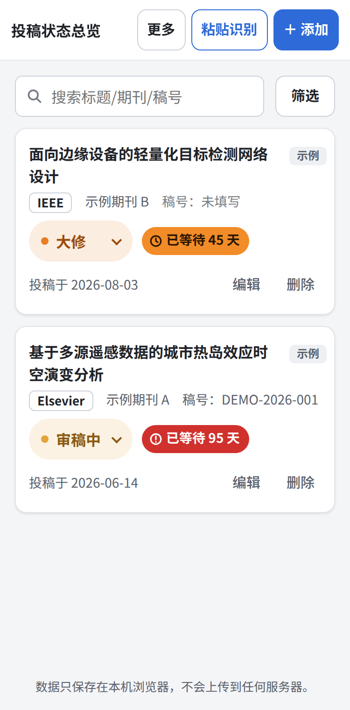

# 投稿状态总览（paper-submission-tracker）

一个只在你自己浏览器里运行的「论文投稿状态总览」网页。它把分散在 Elsevier、IEEE、会议系统和其他期刊的稿件集中到一个页面，打开就能看到每篇稿件的状态和已经等了多少天。

**在线使用：** <https://muse770424.github.io/paper-submission-tracker/>

粘贴识别截图、手机端截图

> 截图中的论文和稿件均为虚构数据。

## 功能

| 功能 | 状态 | 说明 |
|---|---|---|
| **粘贴识别** | 测试版 | 在投稿系统页面全选、复制，粘贴进来，自动识别每篇稿件的状态并更新。支持 Elsevier（Editorial Manager、追踪页）、IEEE ScholarOne、IEEE Author Portal |
| 等待天数提醒 | 已完成 | 30 天以内为灰色，31–90 天为橙色，91 天起为红色，一眼就能看出该催哪篇 |
| 导出 Excel / CSV | 已完成 | 导出的是当前筛选后的列表，可以直接用于周报或组会。Excel 里的等待天数也按颜色标出 |
| 纯中文极简界面 | 已完成 | 不需要注册，打开就能用 |
| 数据只在本机 | 已完成 | 不上传任何服务器，详见下方「隐私声明」 |
| 搜索、筛选、排序 | 已完成 | 可按标题、期刊、稿号搜索；可按状态、来源筛选；可按投稿日期或等待天数排序 |
| 自定义状态 | 已完成 | 可以在 7 个预置状态之外，新增「外审二轮」这类自己的状态 |
| 备份与恢复 | 已完成 | 可把全部数据导出为一个文件，换电脑或换浏览器时用它恢复 |
| 手机可用 | 已完成 | 在 375px 宽的手机屏幕上也能正常使用 |

## 快速开始

1. **打开网页**：访问上面的在线地址，或者下载 `index.html` 后双击打开。
2. **用粘贴识别录入**：登录投稿系统，打开稿件列表页，全选（Ctrl+A）并复制（Ctrl+C）。回到本工具点「粘贴识别」，粘贴后点「开始识别」，核对结果后点「应用」。
3. **也可以手动添加**：点「＋ 添加论文」，填写标题、来源类型、投稿日期，保存即可。状态有变化时，直接在卡片上的状态下拉框里修改。
4. **定期备份**：点「更多」→「备份全部数据」，把下载的备份文件存到网盘或 U 盘。

## 粘贴识别（测试版）

### 支持哪些页面

| 投稿系统 | 可以粘贴的页面 | 能识别到的细度 |
|---|---|---|
| Elsevier | Editorial Manager 稿件列表、稿件追踪页，或单个状态词 | 较细，如 With Editor、Under Review、Decision in Process |
| IEEE ScholarOne（Manuscript Central） | Author Dashboard 各稿件列表，或单个状态词 | 较细，如 Awaiting Reviewer Scores、Awaiting AE Recommendation |
| IEEE Author Portal | My Submissions 页面，或单个状态词 | **较粗**，审稿全过程都显示为 Under Review，这是系统本身的限制 |

IEEE 目前新旧系统并存：不少期刊的新投稿已改用 IEEE Author Portal，老稿件和部分期刊仍在 ScholarOne。两种都可以粘贴。

### 识别结果怎么对应到状态

| 投稿系统里的说法（举例） | 本工具的状态 |
|---|---|
| Submitted to Journal、With Editor、Awaiting Admin Processing、Awaiting AE / EIC Assignment、Submitted | 已投稿 |
| Under Review、Awaiting Reviewer Selection / Invitation / Assignment、Awaiting Reviewer Scores、Awaiting AE Recommendation、Awaiting EIC Decision、Decision in Process、Rescinded | 审稿中 |
| Major Revision、Reject/Resubmit: Major Revisions、Accept with Major Revisions | 大修 |
| Minor Revision、Accept with Minor Revisions | 小修 |
| Accept、Accepted、Accepted (Final Files) | 已接收 |
| Reject、Rejected、Reject without Further Consideration、Immediate Reject | 被拒 |
| Withdrawn | 已撤稿 |
| Revise、In Revision、Revise and Resubmit | **让你选**大修还是小修 |
| Rejected（页面上有 Start resubmission）、Reject & Resubmit | **让你选**被拒还是大修（重投） |
| Draft、Incomplete、Replaced | 不导入 |

识别到的原始说法（例如 Awaiting AE Recommendation）会记在论文详情的「最近识别」里，方便你知道具体进行到哪一步。

### 怎样找到对应的论文

1. **先按稿号**，忽略修改稿后缀：`TMI-2026-0587.R1` 和 `JCLEPRO-D-26-05110R1` 会分别匹配 `TMI-2026-0587`、`JCLEPRO-D-26-05110`。
2. **稿号对不上再按标题**。标题相同但稿号不同时，会提示「可能是重投后的新稿号」；应用后把稿号改成新的，不会新增重复的论文。
3. **都对不上就新增**，投稿日期取自粘贴内容中最早的日期，你可以在应用前修改。

### 遇到不认识的说法

只粘贴那一个说法，工具会问你它对应哪个状态。勾选「记住这个说法」后，下次粘贴会自动识别。记住的说法可以在「更多」→「管理状态」里删除，也会随「备份全部数据」一起备份。

### 测试版说明

识别规则依据 IEEE、Elsevier 等公开的帮助文档和状态说明编写，用合成样本测试通过，还没有用真实页面的复制结果校准。不同期刊的配置可能不同，识别结果请在点「应用」前核对。如果某个页面识别不准，欢迎提 Issue，附上**去掉标题、姓名等个人信息后**的复制文字。

## 隐私声明

- **你的数据只保存在当前浏览器里**，使用的是浏览器自带的本地存储，不会上传到任何服务器，也不会发送给作者。
- **粘贴识别只在本机进行**：粘贴的文字不会保存，关闭识别窗口即清空。工具只保存你点「应用」后的结果（状态、稿号、标题、识别到的状态说法），以及你主动勾选「记住」的说法。
- **本工具不会读取你的投稿系统链接**。「追踪链接」只是一个备忘，工具不会打开或抓取它；点开链接是你自己在浏览器里的操作。
- **页面不加载任何外部脚本、字体或统计代码**，全部功能都写在一个 `index.html` 文件里，你可以自己打开文件核对。
- **通过在线地址访问时**，GitHub Pages 会像普通网站一样把这个页面文件发给你的浏览器。页面加载完之后，你录入的内容不会再发送到 GitHub 或任何其他地方。
- **本工具不会向你索要投稿系统的账号和密码。**
- **数据存在本机也有代价**：清除浏览器数据、换浏览器、换电脑后，都看不到原来的记录。请养成定期「备份全部数据」的习惯。

## 备份与迁移

不同浏览器之间、本机文件版和在线版之间，数据互不相通。要把数据搬到另一处：

1. 在原来的地方点「更多」→「备份全部数据」，得到 `投稿备份_日期.json`。
2. 在新的地方点「更多」→「从备份恢复」，选择这个文件。
3. 选择恢复方式：
   - **合并**：保留现有论文，只把备份里的论文加进来。同一篇论文只保留最后修改较新的版本。
   - **覆盖**：用备份替换现有数据。覆盖前，页面会自动下载一份当前数据的备份。

旧版本导出的备份文件可以直接恢复。

## 状态与等待天数规则

| 状态 | 颜色 | 等待天数 |
|---|---|---|
| 已投稿 | 蓝 `#4A90D9` | 从投稿日期算到今天 |
| 审稿中 | 黄 `#E6A23C` | 从投稿日期算到今天 |
| 大修 | 橙 `#E67E22` | 从投稿日期算到今天 |
| 小修 | 浅绿 `#7CB342` | 从投稿日期算到今天 |
| 已接收 | 绿 `#52C41A` | 停在出结果那天，显示「历时 N 天」 |
| 被拒 | 红 `#EA6668` | 停在出结果那天，显示「历时 N 天」 |
| 已撤稿 | 灰 `#909399` | 停在出结果那天，显示「历时 N 天」 |

- 天数按日历日计算，第 30 天仍为正常色，第 91 天起标红。
- 自定义状态可以设置是否算「已出结果」。

## 常见问题

**为什么不能直接填链接自动查状态？**
投稿系统需要登录，浏览器也不允许一个网页去读取另一个网站的内容；要做到就得搭服务器、经手你的登录状态，这和「数据只在本机」的原则冲突。所以本工具选择让你复制页面文字，由工具在本机识别。

**IEEE Author Portal 为什么一直显示「审稿中」？**
Author Portal 给作者看的状态很粗，从找审稿人到等待决定都显示为 Under Review。想看更细的进度，只能等决定信或联系编辑部。

**换了电脑，数据会自动同步吗？**
不会。本工具没有服务器，需要用「备份全部数据」和「从备份恢复」手动迁移。

**导出的 CSV 用 Excel 打开是乱码？**
正常情况下不会，文件已经带了 UTF-8 标记。如果仍然乱码，可以改用「导出 Excel」。

**支持哪些浏览器？**
已用 Chromium 内核做过完整测试，Chrome、Edge 都使用这个内核。Safari、Firefox 暂未系统测试，欢迎反馈问题。

## 开发计划

- [x] 第 1 阶段：手动录入、卡片列表、等待天数提醒
- [x] 第 2 阶段：搜索、筛选、排序，导入导出，自定义状态，开源发布
- [x] 第 3 阶段：Elsevier 粘贴识别（调研结论：自动读取链接不可行，改为粘贴文字识别）
- [x] 第 4 阶段：IEEE 粘贴识别，支持 ScholarOne 和 Author Portal（[调研报告](docs/stage4-ieee-research.md)、[自测报告](docs/stage4-test-report.md)）
- [ ] 第 5 阶段：统计视图、超 90 天提醒汇总

## 自测

识别引擎和页面交互都有自动化测试，样本均为合成数据，见 [tests/README.md](tests/README.md)。

## 许可证

本项目以 [MIT License](LICENSE) 开源：可以免费使用、修改、分发，包括商业用途，但需要保留原版权声明。本软件按「原样」提供，不附带任何担保。
